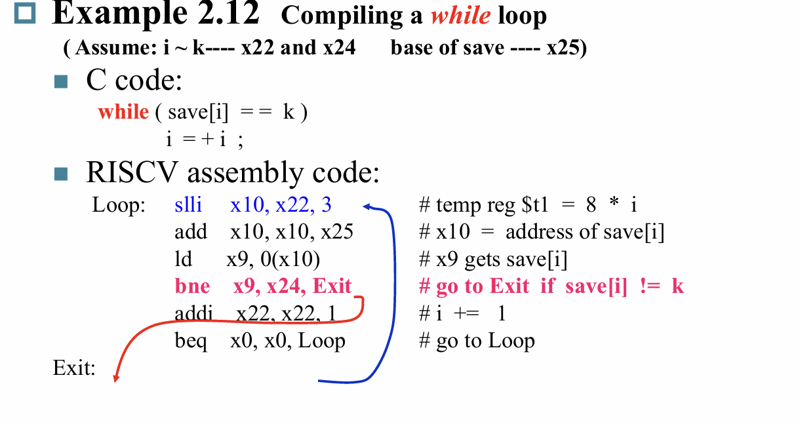
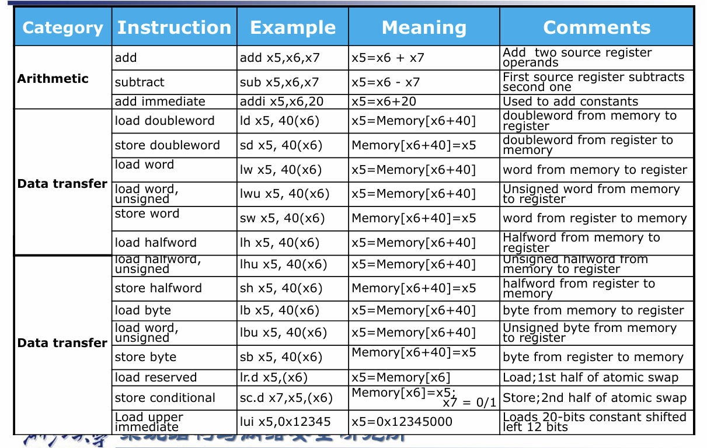
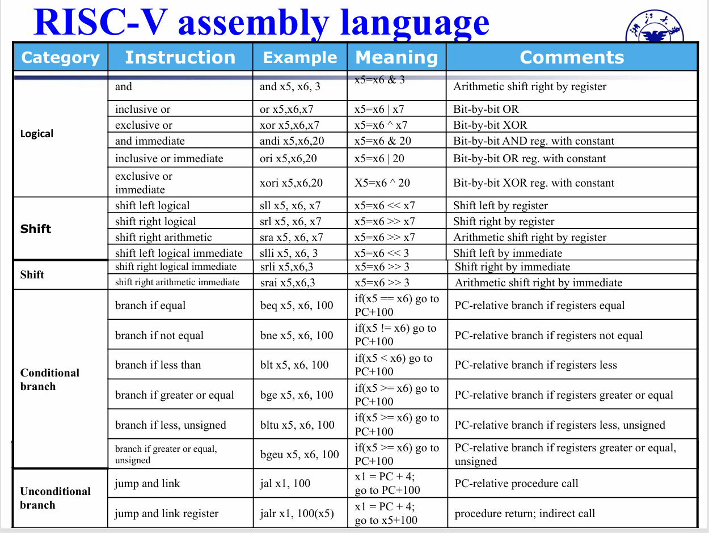

# RISC-V指令格式

务必记住以下指令格式,特别是立即数的位数

其中SB和UJ类型指令的立即数没有第0位是因为默认最低位为0
U指令的立即数低位全部补0

---------------------------

一个小的总结

# Branch

-----------------------------

-----------------------------

-----------------------------
还可以通过slt(set on less than)来进行操作

除了上述的branch还有诸如blt,bge之类的branch

# Jump

## 调用

# 堆栈

大概的流程就是先开辟一段堆栈空间,然后将需要保存的寄存器压入堆栈(sd),等处理完后再从堆栈中恢复数据(ld),最后释放堆栈

同时可以看出每次都要在堆栈中保存寄存器显然比较麻烦,所以RISC-V对寄存器进行了以下的划分

记住别名即可,一共有:
- 7个临时寄存器(t0~t6)
- 8个参数/结果寄存器(a0~a7)
- 11个保存寄存器(s1~s11)
- 1个保存寄存器/框架指针(s0/fp)
- 零寄存器(zero)
- 返回地址寄存器(ra)
- 堆栈指针(sp)
- 全局指针(gp)
- 线程指针(tp)

## 递归

用汇编来理解递归是一个较难的点,所以需要多看

## 堆栈调用

# 内存分布

# RISC-V 指令集(仅涵盖一部分)

-----------------------------

# 立即数操作

lui在操作立即数的时候,若低位想要的数的第11位为1,
则其在运算的时候会进行符号位的扩展,变成前面全1的位,这样一来我们就需要对lui指令的那个数进行加1操作
从而通过进位把符号扩展给舍去

--------------------------------

--------------------------------

上述两个指令的立即数要注意最低位的0,在算实际填入指令的码的时候其地址需要除2

