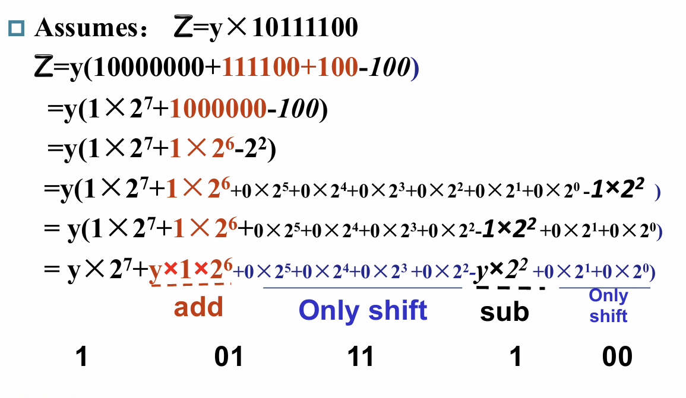
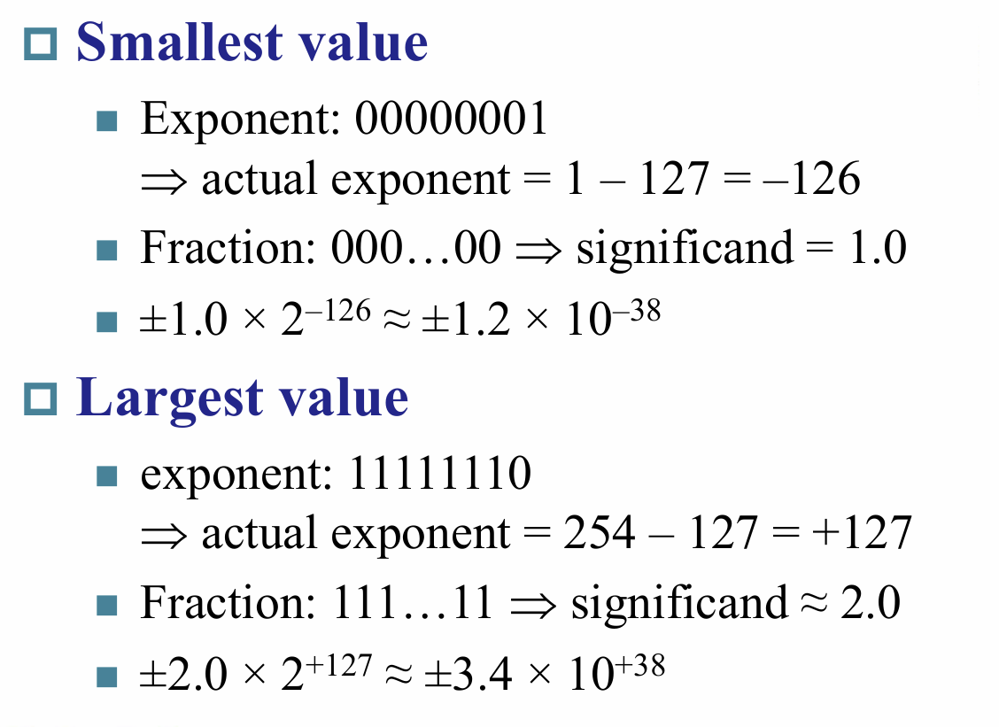

# ALU

## Adder

加法器

提前进位加法器

就是把进位拆开,不必要等待前面的计算结果,直接由源数据分别计算得到

分组提前进位加法器

--------------------------------

--------------------------------

在这张图中G0\~3,P0\~3是同时生成的,但是C1~C4是有顺序生成的,result则需要根据这些进位进行计算

## Multiplier

在书上有逐步优化乘法器的过程,在这边直接给出最优化的一种

乘数放在积寄存器的低位,通过不断右移进行判断,如果右移出一个1,则把积寄存器的高位与被乘数进行相加,因为有64位所以最终需要进行64轮循环

流程图如下:

可以用Booth'Algorithm进行优化算法

可以看下面这个具体例子进行理解

也就是说尽可能的把1的数量减少,从而让乘法器只需做积寄存器的右移而无需加上或减去被乘数

具体的硬件设计可以采取下图的办法

注意前面一位才是current bit,需要注意这边的移动是算数移动不能改变符号位

下面是对这个算法的计算机计算过程模拟

这边的最后一位是last bit而不是current bit

更快的寄存器设计方法:拆解循环,把乘法拆解成加法,然后通过硬件实现

## Divider

同样这边也只给出最优化的版本

被除数放在余数寄存器的低位
然后进行左移,用被除数减去除数,判断结果是否为负,若为负则需要恢复,把除数加回去,然后余数寄存器最低位置0,否则最低位置1

流程图如下:

一个具体的例子如下:

这边最后又右移了一位是因为一开始提前多移了一位

## 浮点数

单精度浮点数有`1`位符号位`8`位指数位,`23`位小数位
双精度浮点数有`1`位符号位`11`位指数位,`52`位小数位

对于指数,它是有偏移的(bias)也就是说在指数位对应的二进制数并不是实际的指数,而是要减去bias

单精度的bias为`127`,双精度的为`1023`

同时对于浮点数,我们将隐藏第一个1,小数位其实最前面包含了一个1,但是我们没有保存

计算方法如下

通过一个例子来进行理解:

需要注意的是,浮点数的指数部分对于全0和全1是进行保留的
也就是说这两个特殊的指数不按照上面的规则进行处理

进而我们可以得到对于单精度和双精度的最值(就绝对值而言)

-----------------------------

前面提到有保留的指数值,具体保留的作用如下:
- 指数部分全1,小数部分全0:表示无穷大(根据符号位来判断是正无穷还是负无穷)
- 指数部分全1,小数部分不为0:表示`NaN`,即不是一个合法的数字
- 指数部分全0,小数部分全0:表示0
- 指数部分全0,小数部分不为0:表示没有规格化后的数字(所谓非规格化就是没有隐藏1了),此时的指数部分当作1而不是0来处理,也就是说真实的值为(1-bias)
 
这样的设计可以实现从非规格化数据到规格化数据的平滑过渡

### 浮点数加法

1. 进行对齐(小的向大的靠齐)
2. 对小数部分进行相加
3. 规格化结果
4. 判断溢出
5. 舍入

算法流程图如下:

通过一个简单的例子进行理解:

具体的硬件设计如下:

### 浮点数乘法

1. 将指数进行相加(需要减去一份bias)
2. 将小数部分进行相乘
3. 规格化
4. 溢出判断
5. 舍入
6. 确定符号

算法流程图如下:

具体硬件设计如下:

### 浮点数除法

了解即可,大概流程如下:
1. 减去指数(加上一份bias)
2. 对小数部分进行除法
3. 规格化
4. 舍入
5. 确定符号位

### 有关舍入

在计算的过程中如果我们对每一次的计算都进行一次截断到精确的位数,那么对于最终的结果我们将没法实现舍入

所以在计算的过程中我们额外保留两个位称为`guard`和`round`位

这两个位是额外多出来的,也就是说舍入的时候要依据这两个位来进行

这里再引入一个概念`ulp`(units in the last place):表示真实数字与表示数据之间差了几个最后一位的数

为了确保每次舍入的ulp最多为0.5,我们必须再引入一个新的位,称之为`sticky`位,位于第三位,这个位的作用就是用来判断右移的时候是否有1移出,一旦有就直接置1,从而能够判断出0.50...000和0.50...001的区别,结合前面设置的两个位就能够确保ulp不大于0.5了
