# 中断与异常

改变CPU程序执行流有几种可能:
- 在程序中的控制指令
- 无法预测的中断或异常发生

异常(Exception):狭义的异常由处理器内部发出,广义的异常包括中断

中断(Interrupt):由处理器外部造成(Input/Output)

处理异常需要下面几个步骤
1. 保存当前的PC值:存放在SEPC(Supervisor Exception Program Counter)
2. 保存关于问题的描述:存放在SCAUSE(Supervisor Exception Cause Register)
3. 跳转到处理函数
   1. 进行相应的行为来处理异常
   2. 若可以重启,采取应该执行的正常行为并通过SEPC跳回原程序流
   3. 若必须终止程序,则终止后通过SEPC,SCAUSE...进行报错 

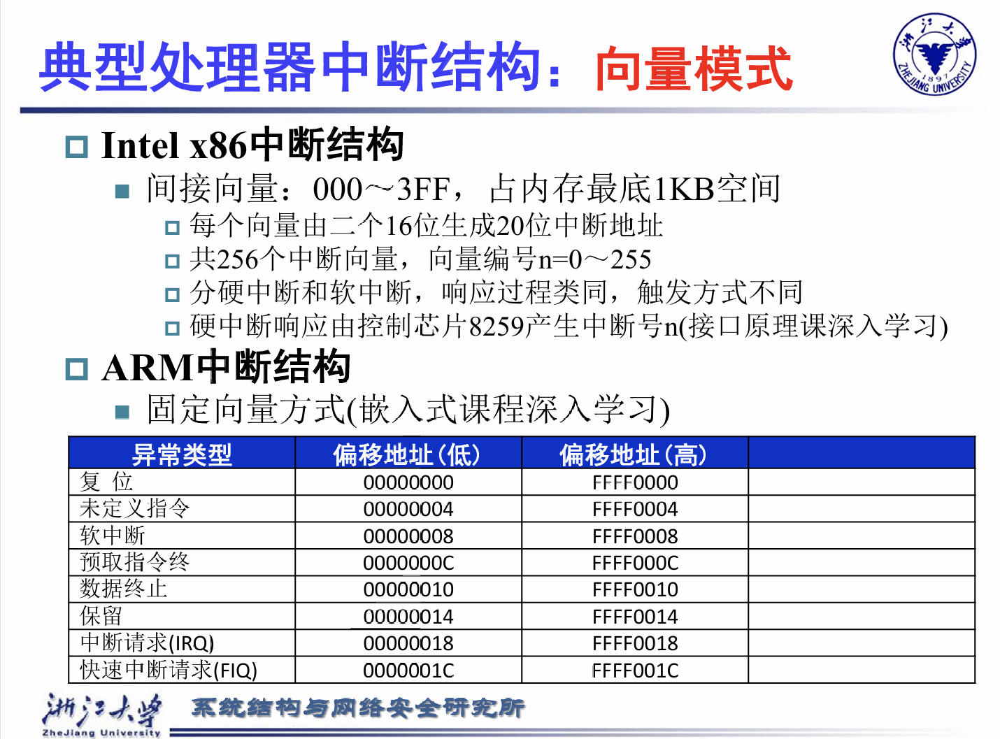

RISC-V中有不同的模式,不同模式的权限是不一样的

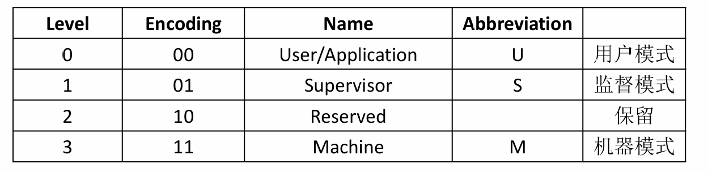

所有硬件的实现必须提供M模式,M模式最重要的工作就是处理中断

## CSRs(Control and Status Registers)

一组额外的寄存器,只有一些特定的级别才可以使用相关的CSR指令进行操作

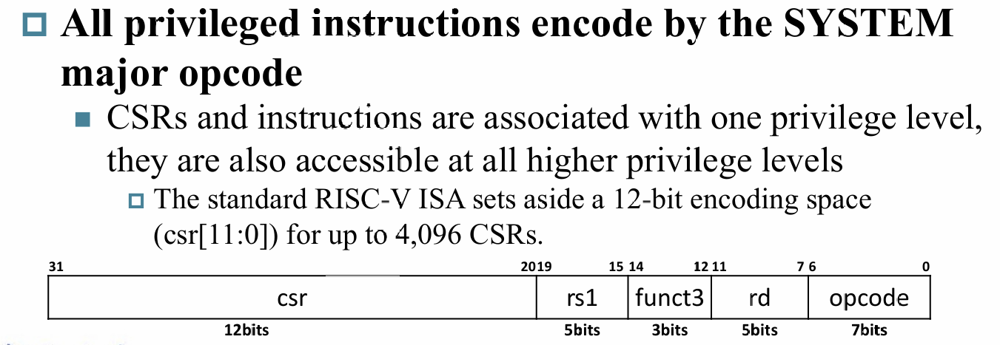

-----------------------------

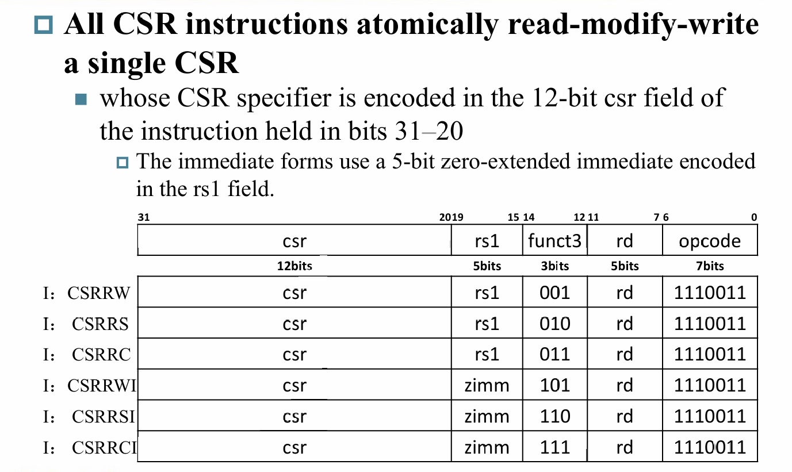

-----------------------------

其中一些寄存器:

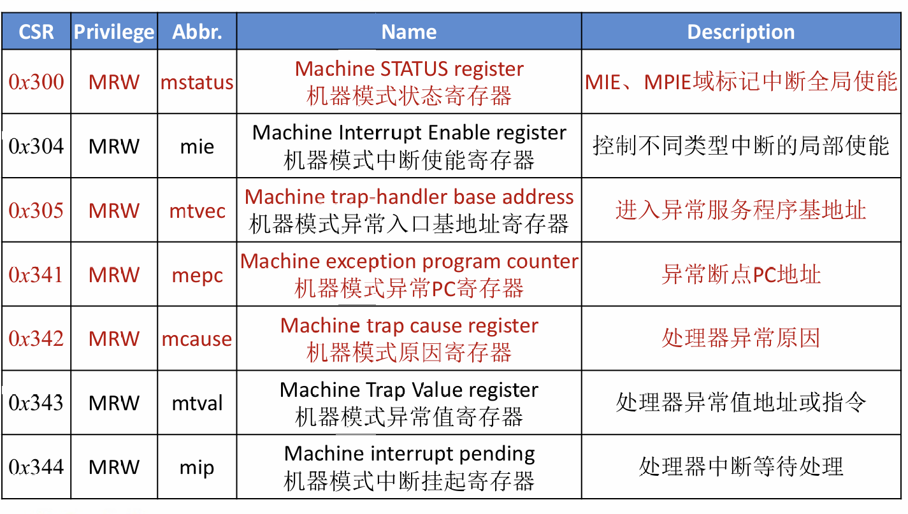

### Mstatus

### Mie/Mip

### Mtvec

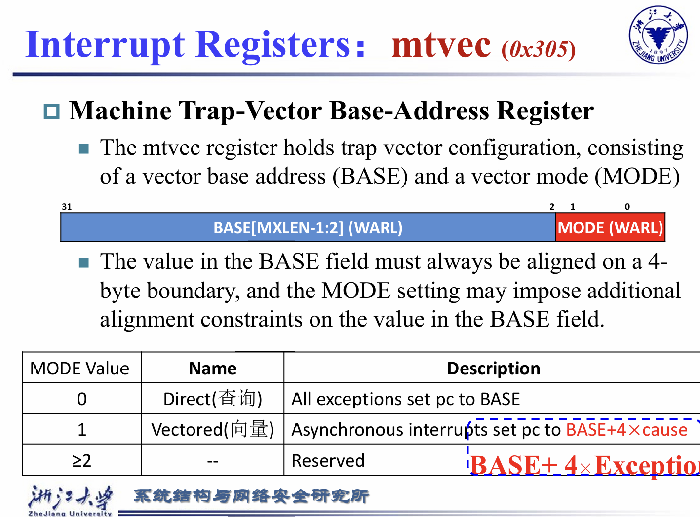

### Mepc

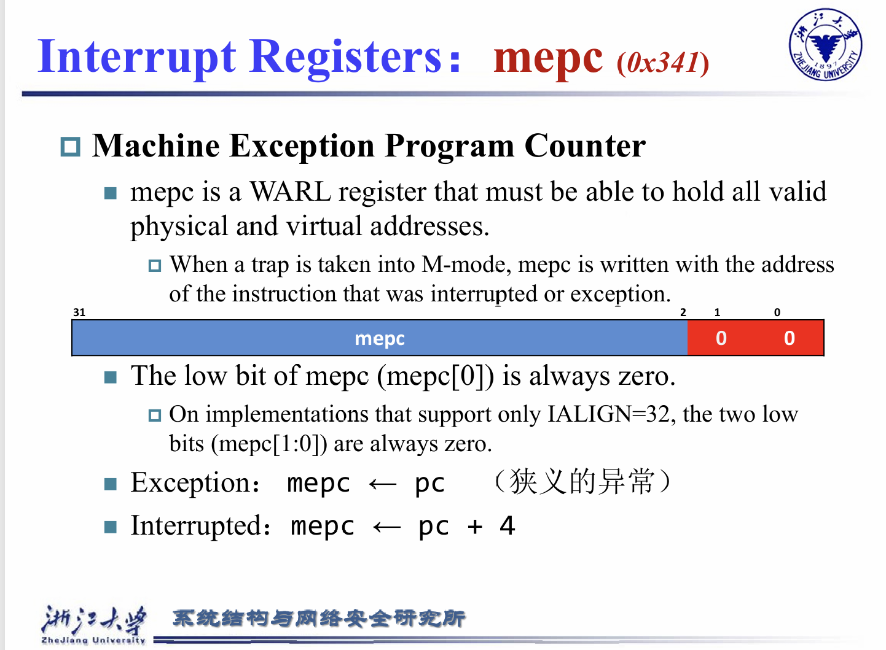

### Mcause

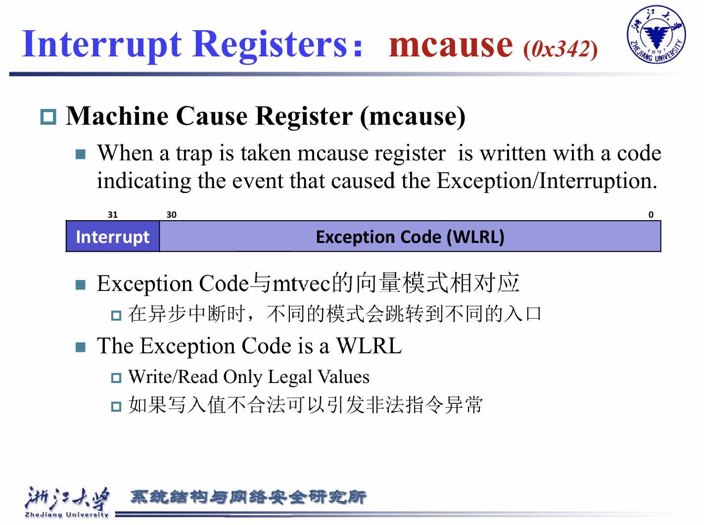

--------------------------------

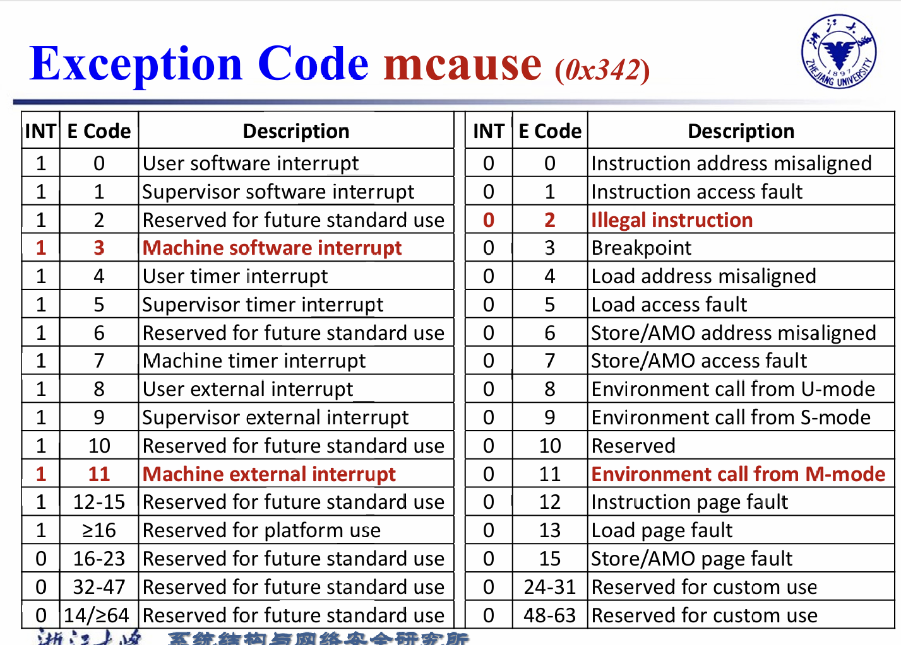

### 中断优先级

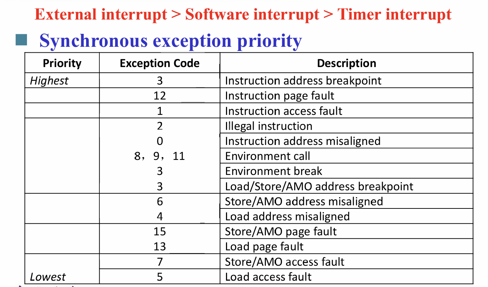

## 异常处理流程

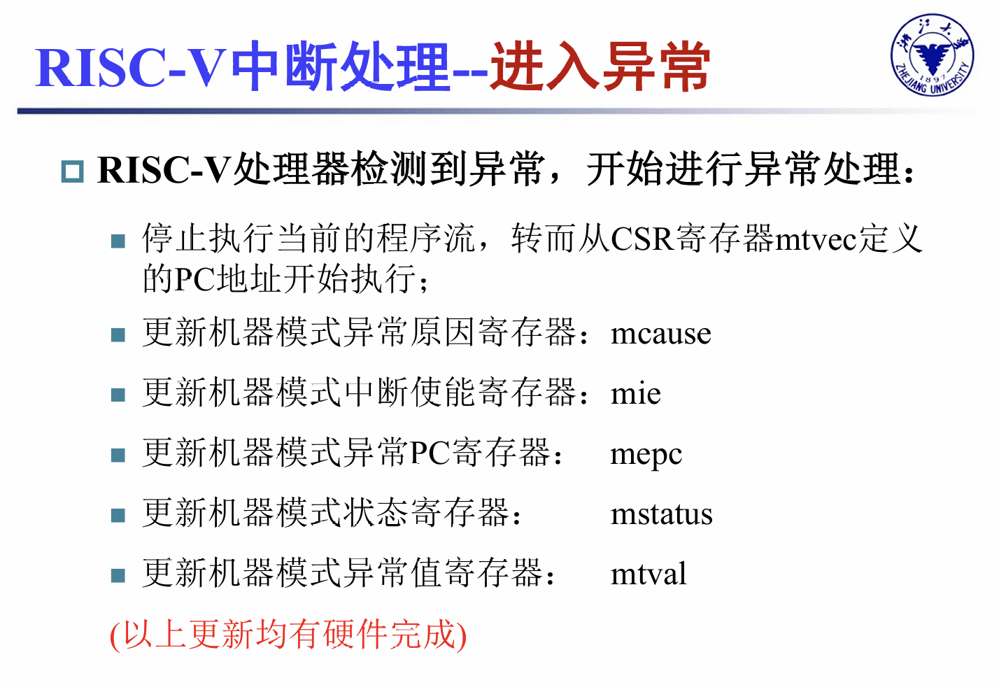

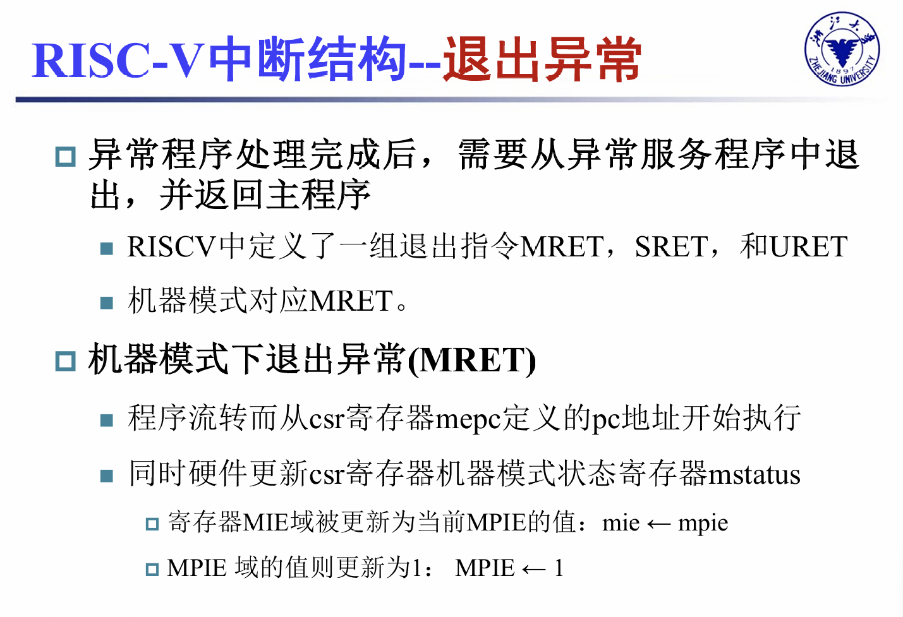

## 其他中断指令

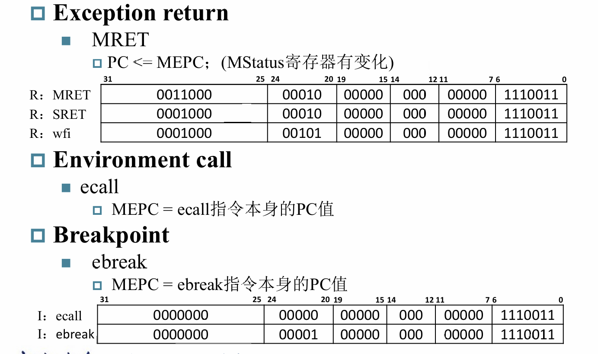
