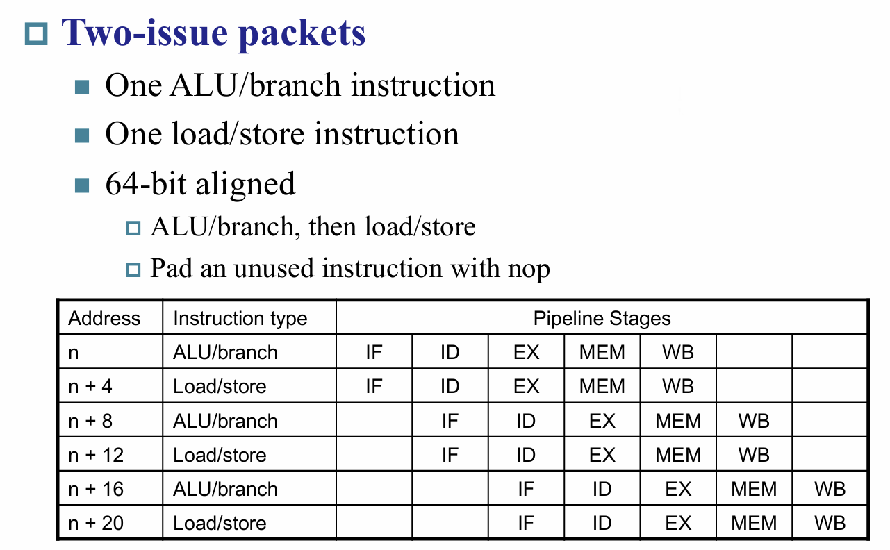

# 流水线

RISC-V的流水线大概可以切分为5个part:
1. `IF`: 从指令内存中读取指令
2. `ID`: 指令解码与寄存器读取
3. `EX`: 执行指令或计算地址
4. `MEM`: 访问内存
5. `WB`: 写回寄存器


理论上来说,性能可以提升五倍
虽然每一条的指令所需的时钟周期不变,但是CPI可以被提升到1

需要注意的是，设计流水线的时候应该以所需时间最长的part作为时钟周期,这样才能实现对齐,即便有一个part的操作已经完成了,也需要进行等待

总结:`Throughput is increased but not Latency(time for each instruction)`

## Hazard(冒险)

一种阻止下一个操作在下一个时钟周期进行的情况

当发生冒险时,将会在流水线中产生气泡(`bubble`)

分为以下几种hazards:
1. `Structure hazards`:一个需要的资源被占用
2. `Data hazard`: 必须等待前一个指令执行完它的数据读取/写入才可以进行
3. `Control hazard`:控制信号的决定取决于前一条指令

### 结构冒险

由于RISC-V是设计了流水线结构的,所以实际上并不会发生这种情况

但是想象一下如果说指令内存和数据内存存放在同一个内存中,那么当Load/store指令到来时,将会触发取指和取数据/存数据的结构冒险


### 数据冒险

直接看一个例子就可以很直观的理解了


第二条指令所需要的源操作数依赖于第一条指令的`WB`,所以在第二条指令进行`EX`前,第一条指令的`WB`必须完成

#### 解决方法

- `Forwarding(Bypassing)`:提前将所需数据通过旁路提前给予下一条指令,不需要等待其存入寄存器再读取得到


如上图,一下子就省去了两个气泡

但是这个方法并不是万能的,比如下图
`Load-Use Data Hazard`


不得已只能够插入一个气泡,然后再`MEM`后接旁道到下一条指令

- `Code Scheduling`:通过合理安排代码从而避免冒险的形成
  


由于对应指令没有依赖关系,所以对指令进行乱序执行并不会影响最终结果

### 控制冒险

Branch决定了控制流,但是取出下一条指令取决于branch的输出结果,流水线无法总时取得正确的指令

在RISC-V流水线中,可以提前在流水线中进行寄存器的比较和计算,通过在`ID`阶段添加硬件实现


## 具体实现

### 数据通路


图中蓝色的线表示从右到左的数据流,正是这样的数据流导致了冒险的发生


为了实现流水线,需要通过寄存器来保存前一个时钟周期的信息

根据五个part我们需要用到四个寄存器

- `IF/ID`
- `ID/EX`
- `EX/MEM`
- `MEM/WB`

需要注意到,对于写回的寄存器地址,是来自于`MEM/WB`,这个时候对应的地址才是正确的


### 控制信号


通过在ID阶段进行解码得到的控制信号传递给寄存器.
需要注意到对于每个寄存器只需要存这个阶段之后需要用到的信号即可,前面阶段的控制信号可以不保存

### 检测冒险

- `Forwarding`的检测:

有以下几种情况会发生数据冒险,可以根据上面的图进行理解:


旁路的简化通路如下:


从`EX/MEM`和`MEM/WB`中取出rd的操作数,然后与`ID/EX`中的rs1和rs2进行判断,若相等则取数据的时候直接取对应流水线寄存器中的数据即可,多路选择器的信号假设如下


但是当两个相邻数据冒险同时发生的时候,情况需要多加考虑,如下述例子:

```asm
add x1,x1,x2
add x1,x1,x3
add x1,x1,x4
```

对于第三条指令,其通过数据旁路获得的x1值肯定是要离它最近的,也就是第二条指令计算得到的x1,所以我们要从`EX/MEM`中提前取出

所以考虑上这一点后，最终我们得到的逻辑应该如下:


Forward取的数据为`MEM/WB`当且仅当该寄存器中的寄存器写信号有效且写入地址不为0(零寄存器不能被写入),并且`EX/MEM`寄存器无需Forward的时候才可行

图中蓝色部分实际上就是取数据为`EX/MEM`寄存器的条件的非


- `Load-Use`的检测

有以下情况会导致该冒险发生:


也就是当前一条指令需要读取内存并且存放的目标寄存器与当前取出来的这条指令的其中一个原操作寄存器是一样的

如果检测到了,需要停下来并且插入一个气泡进行一个时钟周期的暂停

对流水线进行一个时钟周期的暂停其实很简单:

1. 强制让`ID/EX`寄存器中的控制信号全部为0,这样一来`EX``MEM``WB`全部都执行一个nop(no-operation)
2. 阻止PC和`IF/ID`寄存器的更新
    - 用过指令会被再一次解码
    - 下一条指令会被重新再取一遍
    - 1个时钟周期的暂停将会让`MEM`读取到对应ld的data,这样一来就可以forwarding到EX阶段了

一个简单的例子如下:


在第二个时钟周期检测到了冒险以后,让PC和`IF/ID`保持不变,`ID/EX`控制信号置为0(此时原来的ID/EX信号已经被执行过了,所以不用担心上一条指令受影响)

在随后的时钟周期这些0控制信号将会沿着流水线传递下去

然后下一条指令刚好能在第五个时钟周期从旁路获得正确的数据

实际线路图大致如下:


- `Branch`
若Branch的结果在`MEM`阶段才出来(可以回看上面的控制信号流水线图)

则有可能出现下面的情况:


这里我们采用的是默认顺序执行,这样一来根据`MEM`的结果我们可能需要对下面三条指令进行`flush`也就是对于`IF/ID``ID/EX``EX/MEM`的控制信号全部置为0

但是这样一来可能就会造成不必要的延迟,所以我们采用将结果在`ID`阶段就算出来的方法进行改进,只需要用一个加法器和比较器就可以在该阶段得到结果,如果结果是要跳转,则直接在IF/ID插入一个气泡即可

可以通过下面这个例子进行理解


--------------------------------


--------------------------------

但是对于层次更多的流水线来说,跳转的惩罚变得更加明显,所以我们可以采用动态预测的方式


对于预测我们有1-bit预测和2-bit预测,也就是用几个bit来标志上一次的状态

对于1-bit预测来说,对于嵌套循环局限性比较大


2-bit相对来说会好一点


既然我们用表来存放上一次是否跳转,不妨同时把计算得到的目标地址也放到一个表里进行查询,这样就无需多次重复计算,如果命中了,则可以立即取出下一条指令,从而提高效率


# 指令级并行

Instruction-Level Parallelism(ILP)

要增加ILP有以下几种方法:
1. 采用更深的流水线,每个阶段干的事情更少,时钟周期可以进一步缩短
2. 多发(Multiple issue)
   - 实现多条流水线
   - 在每一个时钟周期开始多条指令
   - CPI<1
   - 由于依赖的存在,在实际的运用中将达不到理想效果 

多发有以下两种实现方式:
- 静态多发:
  - 编译器将多条指令打包在一起进行发射
  - 然后将他们发射进`issue slots`里面(在给定的时钟周期可以进行发射的地方)
  - 编译器自己进行检测和避免冒险
- 动态多发
  - CPU自己对指令流进行测验并选择每次进行多发的指令
  - 编译器可以通过重排指令来帮助其完成这一任务
  - CPU通过提前来解决运行时遇到的冒险

## 静态多发

### 双发

假设现在有以下的双发


一条指令必须为ALU/branch指令,另一条指令为load/store指令

其对应的示意图如下:


对于双发来说,必然也有可能造成冒险
比如说不能够在同一个包中运用ALU的结果于load/store操作
```
add x10,x0,x1
ld x2,0(x10)
```
这样的话就需要将其拆成两个包

可以通过下面的例子进行更深刻的理解


### 循环拆解

将循环体拆解成更多的并行从而减少整体的循环控制
```c
for(i=0;i<n;i++){
    a[i]+=i;
}

//可以改成

for(i=0;i<n;i=i+4){
    a[i]+=i;
    a[i+1]=i+1;
    a[i+2]=i+2;
    a[i+3]=i+3;
}
```
通过拆解循环从而将原本使用一个寄存器的情况转化成每次循环用多个不同的寄存器,我们称之为`register renaming`用来避免循环包含着`anti-dependencies`(`name dependence`)也就是说并不是真正的依赖,只是因为使用了同一个寄存器而导致看起来像是依赖一样

下面是展开后的效果


### 预测

软硬件对指令的预测各有不同


## 动态多发

### 动态规划CPU

通常又被称为`superscalar`处理器


主要由三个part构成
- `Instruction fetch and decode unit`
- `Functional units`
- `Commit unit`,也被称为`reorder buffer`


第一个模块负责取指并对其解码,然后将其发送到相应的功能模块,每个功能模块前有buffer,当它所需要的数据在buffer中存在时就开始进行运算,然后将结果放到另一个buffer中,当确定可以安全写回后再进行写回(寄存器或内存)

需要注意的是,虽然中间的过程是乱序执行的,但是取指和写回都是按序执行的

一个大概的获取数据流程如下:


### 预测

