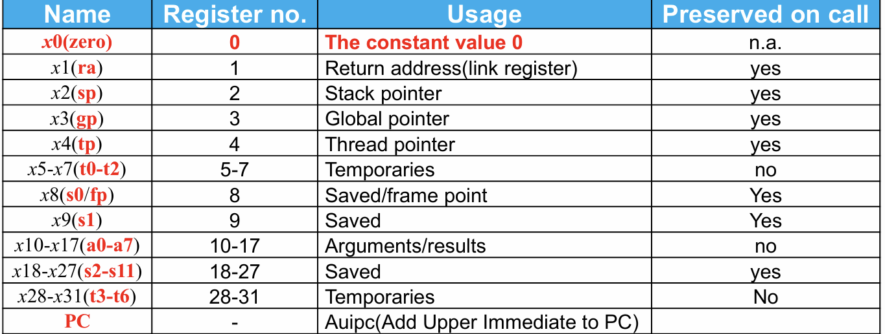
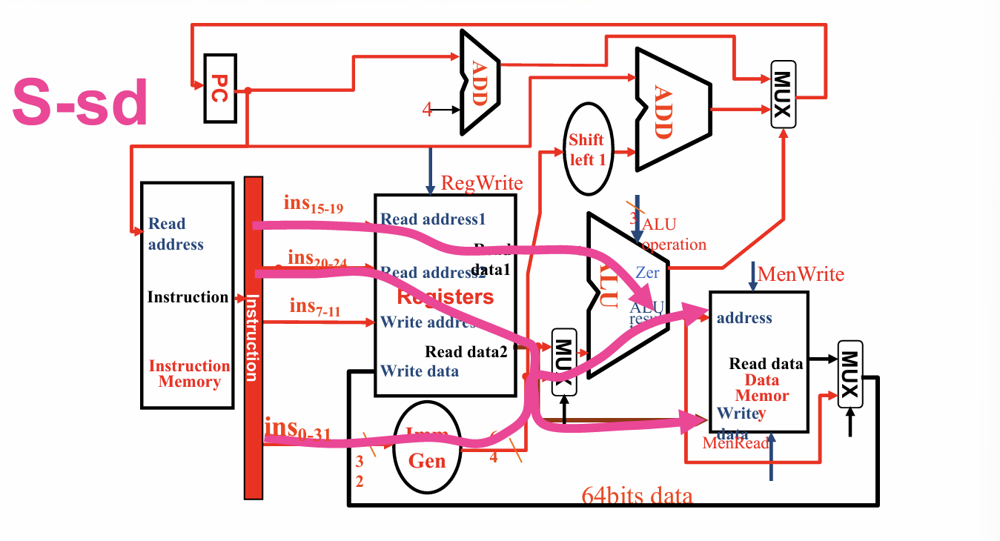

# 引言

- CPU的性能要素
  - 指令数:取决于指令集和编译器
  - CPI和时钟周期:取决于CPU硬件设计
- 在该课程中实现了RISC-V的两种实现
  - 一个更简单的指令版本  
  - 一个更可行的流水线版本
- 指令子集:
  - 内存索引:`ld`,`sd`
  - 算数/逻辑运算:`add`,`sub`,`and`,`or`
  - 控制转移:`beq`
- 指令的实现过程:
    1. 从内存中取指
    2. 解码指令并读取寄存器
    3. 根据指令种类:
       - 内存索引
       - 算数/逻辑运算
       - 跳转
-  取决于指令种类的几个操作
   -  使用ALU
      - 运算结果
      - 用来load/store的内存
      - 跳转(Branch)对比
    - 从内存获取数据进行load/store
    - PC -> PC+4 / 目标地址

- 计算机大致组成

# 数据通路

数据通路是用来处理数据和地址的部件

先回顾一下RISC-V指令集的指令形式:

其中
- opcode:决定指令的基础操作
- rs1:第一个源寄存器
- rs2:第二个源寄存器
- rd:目标寄存器
- funct:决定在同一基础操作的不同操作
- Immediate:地址或立即数

RISC-V中的不同寄存器及其用途:

指令在RISC-V的执行过程如下:
1. 取指令
   - 从指令内存中取出指令
   - 调整PC指针指向下一条指令
2. 指令解码和寄存器读取
   - 将指令翻译成机器控制信号
   - 读取rs1和rs2寄存器的值,后面再决定是否使用
3. 执行运算的控制:控制ALU进行相应的计算操作
4. 内存访问:当且仅当load/store指令才有,从内存读或写数据
5. 将结果写回寄存器
   - 可能是ALU结果写回rd
   - 或者是内存数据写回rd
6. 对于Branch操作,需要调整PC 

## R型指令与数据流

## I型指令与数据流

注意这边只考虑了load指令,但是对于立即数的数学运算如addi则需要考虑从ALU直接引一条线到rd,通过控制单元决定从哪里获取数据

## S型指令与数据流

需要注意,出于设计上的方便,rs1为存放基址的寄存器,rs2才是存放数据的寄存器

## SB型指令与数据流

注意beq指令是以其立即数作为偏移地址进行跳转的

## UJ型指令与数据流

注意jal指令也是以立即数作为偏移地址进行跳转的,同时还要把下一条指令的地址存放到寄存器中

## 完整的数据通路

在其中各种指令的流通如下(建议自己过一遍)

---------------------------

---------------------------

---------------------------

---------------------------

---------------------------

---------------------------

# 控制器

一共有7+4个信号(可能与实验设计有所出入):

`RegWrite`:控制寄存器是否进行写操作
`ALUSrc`:选择进入ALU运算的第二个源操作数是来自寄存器还是立即数
`MemRead`:控制数据内存是否能进行读操作(实际上这个信号并不重要,因为读操作是不影响的)
`MemWrite`:控制数据内存能否进行写入操作
`MemtoReg`:选择写回寄存器的数据来自ALU运算结果还是数据内存中的数据
`Branch`:控制第一级选择是PC+4还是PC+立即数
`Jump`:控制第二级选择是PC+4还是PC+立即数

`ALUop`:控制ALU的计算操作是什么

## 二级解码

根据opcode可以大致判断出来这条指令对应的ALU操作,先将其解码成7个控制信号和ALU的一级解码信号
然后根据这个一级解码再去进行二级解码

