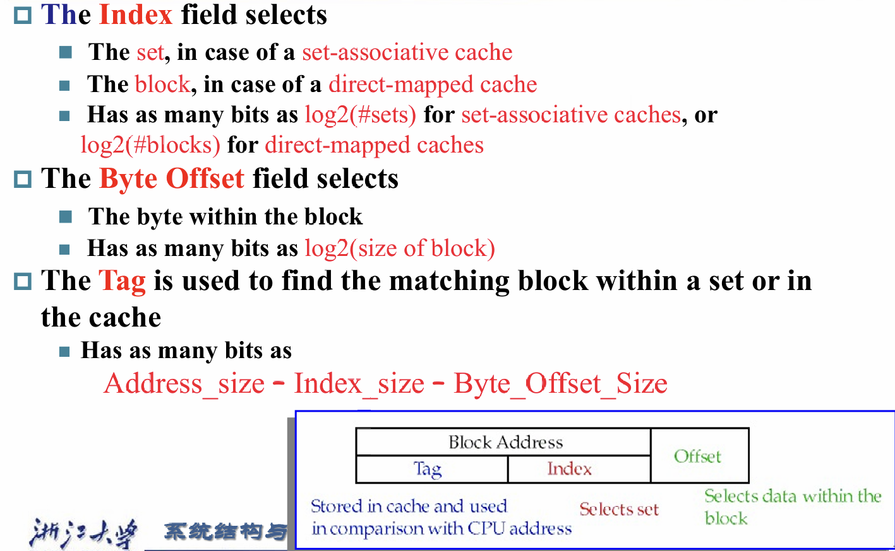
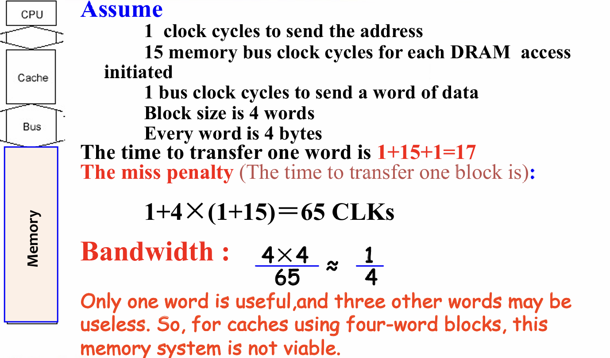

# 存储技术

- SRAM:值存储在非门中,速度最快,但是占据的空间较大
- DRAM:值存储在电容器(capacitor)中(需要刷新),占据的空间小,但是速度比SRAM慢
  
  
  
  - 每个bit在DRAM中是以矩形数组的形式存储的,如上图所示,每次读出一整行到buffer中,再根据列地址选取需要的单元,有个概念叫做`Burst Mode(突发模式)`,即一次性读取多个数据单元从而提高传输效率
  - DDR(DDRAM):在时钟上钟沿和下钟沿都能进行传输
  - QDR(QDRAM):将DDR的输入和输出分开
  - Flash Storage:非易失性半导体存储,价格处于disk和DRAM之间
  - Disk Storage:磁盘存储

# 存储分级

存储分级的依据的两个重要的原理是:
- 时间局部性:最近被访问的单元很有可能等等还要再次被访问
- 空间局部性:被访问的单元附近的单元很可能等等也会被访问

由于存储元件速度越快的单位价格越高,所以为了满足用户的需求,必须设计出一种结构,使得在一定条件下能够让存储单元的总体访问速度提高
如下图的结构:

--------------------------------

## 一些概念

- Block:每次拷贝的单元,根据空间局部性,我们在拷贝的时候不能只拷贝一个字节,而是连同附近的单元也要拷贝,一口气处理的这个单元就叫做Block
- Hit:若需要的数据出现在上层存储中,则称为hit
  - Hit Time: 访问上层存储所需要的时间,包括判断当前访问是hit还是miss的时间 
- Miss:若需要的数据不在上层存储中而需要从下层存储中拷贝,则称为miss
  - Time taken: miss的惩罚
  - Miss ratio: misses / accesses

# Cache

Cache的大小肯定比内存(DRAM)要小,而内存中每一个单元都要能够映射到Cache中对应的一个单元,意味着会有重合

不同的映射方法会导致不同的结果和效率

## 直接映射(Direct Map)

首先这边处理的基本单元都是Block,如图中所示的内存中有32个Block
内存地址模上Cache中所有的Blcok数,对应的数即为在cache中的地址

Cache中的数据结构与对应的地址拆分如下:

先看地址(真实的物理地址)的拆分:
- Byte offset: 与Blcok的大小相关,实际上就是索引Block中第几个字节,所以表示的是Block中的地址
- Index:与Cache有几个Block相关,实际上就是索引Cache中的第几个Blcok,所以表示的是Cache中的地址
- Tag: 用来比对Cache中索引到的Block是不是我们所想要的Block,如果Tag位一样,说明映射到这个Block的内存地址与我们所想访问的内存地址是一致的

再来看Cache中的数据结构:
- Data: 这部分用来存放对应Blcok中的数据
- Tag: 这部分用来存放映射的地址对应的Tag,从而实现比对
- Valid bit: 用来判断这个单元是否存在数据

索引的过程大致如下:

一个计算的例子:

## 全关联(Fully-associative)

Block可以映射到Cache中的任何一个地方

## 组关联(Set-associative)
Block可以映射到对应的set中的任何一个地方
映射公式变为:block地址模上Cache中set的个数

每一个set都是Cache中几个Block的组
实际上直接映射就是1-way set associative

用一张图理解上述三种映射方式

----------------------------------------

物理地址的拆分

## 处理Hit和Miss

### 读取

若命中,那很好了
若不命中:
- 指令miss
- 数据miss

首先要暂停CPU,从内存中取到Block,运输到Cache中,重启CPU进行读操作

### 写入

对于写入有不同的方法和策略

若命中:
- `write-back`:仅将数据写入Cache中,等到这块数据离开Cache的时候再写回内存中,需要多一个bit位(dirty bit)来判断这个block是否被修改过，从而在替换的时候决定是否要写回,由于写内存时间长,且一个数据往往可能被多次修改,所以这种策略可以提速
- `write-through`:将数据写入Cache的同时,将数据也写回到内存中,一个提高这个过程速度的方法是利用一个buffer,在执行其他操作的时候,这个buffer慢慢的往内存写入,虽然这个策略较慢,但是可以保证内存中的数据和Cache中的数据是一致的

  

若不命中:
- `write allocate`: 将对应的block加载进Cache中
- `write around`: 仅在对应的内存中修改block

## Block替换
当Cache中对应的set满了后,需要从set中挑一个block被替换
有一下几种策略:
- 随机替换:顾名思义,随便取一个block进行替换,优点是硬件电路容易实现,缺点是可能把一些常用的block给替换掉
- Least-recently used(LRU):选择set中最没被用过的那个block进行替换,需要额外的bit位来跟踪block的访问情况
- First-in-First-out(FIFO):选择set中最先进来的进行替换

## 四个有关Cache的问题

利用这四个问题来加深对Cache的印象

## 关于内存带宽

### 带宽小

----------------------------

### 带宽大

----------------------------

### 并行

----------------------------

## Cache效率

提高Cache效率大概可以从下面几个角度入手:
- 提升Cache的材料等的性能
- 减少Cache的miss次数,调节映射方式
- 降低Cache的miss惩罚,增加Cache级数

评估Cache效率: `Average Memory Assess time = hit time + miss time`

----------------------------

比较不同映射方法对应的miss率

## 计算练习

# Virtual Memory(虚拟内存)

虚拟内存可以使程序运行的时候似乎获得了更多的物理内存
实现了程序的重定位以及保护

在这里实际上内存是作为disk的cache

虚拟地址转换成物理地址大致如下:

`Page fault`:映射到物理地址后的数据不在内存中而是在disk中,需要从disk中取得

## Page Table

每一个程序都有自己的page table,虚拟内存系统使用全关联的映射方式将表物理地址映射到这章表中,程序通过这张表找到对应的物理地址

当Page fault发生的时候,操作系统将会将控制权限交给中断程序,然后找到在disk中的数据放到内存中,如果对应的地址被占用,那么会利用LRU策略替换

由于写硬盘十分慢,所以虚拟内存系统采用`write-back`策略进行数据的写回,因此需要在表中加一个`dirty bit`

## 计算页表的大小

需要注意虚拟地址的页偏移地址是直接对应的,只有高位的虚拟地址才需要经过表的映射得到对应的物理地址高位

## Page Table的Cache

这个元件实际的名字叫做TLB(Translation-lookaside Buffer),但是本质的作用和Cache是一样的

-------------------------

加上这个元件后整体的流程如下:

## 不同的miss关系

