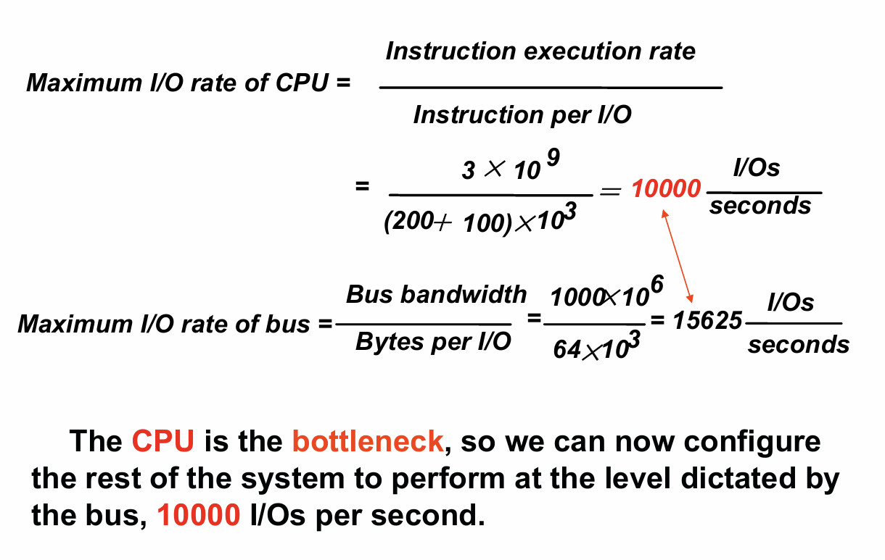

# I/O设备

这一章主要学习有关存储,网络和其他输入输出设备的一些知识

## I/O设备的架构图

三个IO的特征:
- 行为:输入,输出还是存储
- 交互对象:人或者是机器
- 数据传输率:数据在IO设备和存储或者CPU之间的最高传输效率

IO设备的表现:
- `Throughput`:可以理解为带宽,但是这个带宽可以有两种不同的解释方式,第一种是在一个固定的时间内能传输多少数据,也就是我们下意识认为的带宽;另一种是在单位时间内可以进行几次IO操作
- `Response time`:响应时间

## I/O设备的多样性

## Amdahl's law

需要注意的是,即使CPU的速度能够大幅提升,但I/O设备的速度不能跟上的话,也会导致速度提高的倍率下降,也就是说一昧的只提升CPU的速度最终会达到瓶颈,这个瓶颈就是I/O设备的速度

# Storage

磁盘主要有两种:
- `floppy disk`:软盘
- `hard disk`:硬盘

## 机械硬盘

被称作HDD(hard-disk drive)

机械硬盘的主要结构有以下几个部分:
- `platter`:盘片,一个硬盘由许多个盘片构成,每个盘片的上下两面都是可以记录的,同时每个盘片配备了一个读写磁头
- `track`:轨道,每个盘片的表面划了许多道同心的轨道
- `sector`:扇区,每条轨道又被划分成多个扇区,是最小的读写单元,一个扇区通常大小为512Byte

访问硬盘中的数据需要以下几步:
1. `seek`:使读写头找到对应的轨道
2. `rotational latency`:盘片进行旋转,使读写头到对应的扇区
3. `transfer time`:数据传输时间
4. `disk controller`:各种控制信号的处理时间

其中的RPM表示每分钟旋转的次数,由于平均旋转为半圈,所以分子为0.5

提高disk的表现性能有几种方法:
- 利用局部性和操作系统的调度让实际的平均seek时间降低
- 利用更好的disk controller来分配物理扇区,将逻辑扇区的接口暴露给主机即可,常见的协议有SCSI,ATA,SATA
- 给disk准备缓存(cache),预取出扇区中的数据,从而避免seek和rotational latency

## Flash

Flash是一种非易失性存储
比机械硬盘存储快上100~1000倍,更小,功耗更低,也更耐糙,但价格更高

Flash有以下几种:
- `NOR`:更多用来作为嵌入式系统的存储
- `NAND`:更多用来作为U盘或者SSD(solid-state drive/固态硬盘)

flash被多次访问后会坏掉,因此不适合直接作为RAM和disk的替代品,万一某个单元坏掉了,那么可以提前把数据重新映射到用的较少的block中

## 可用性(Availability)

三种方法来提升MTTF:
- `Fault avoidance`:避免错误的发生
- `Fault tolerance`:通过冗余的设计来承担一定程度的错误发生
- `Fault forecasting`:提前预测错误的发生

## RAID
所谓的RAID就是一种提升错误承担能力的方法,通过冗余设计让其能够自主修复

RAID的全称是Redundant Arrays of Inexpensive Disks

在这种策略下,文件被条带化,也就是分成多份后存储在不同的磁盘当中

下面是不同级别的RAID的示意图:

- `RAID 0`:也就是没有冗余
- `RAID 1`:Disk Mirroring/Shadowing,每个disk都有一个完全的复制在另一个磁盘中

- `RAID 2`:没有使用,所以这里不研究
- `RAID 3`:Bit-Interleaved Parity disk,通过一个额外的磁盘来存放校验码,通过校验码就可以恢复对应磁盘中的数据

- `RAID 4`:延续RAID3的思想,只不过是以块为单位进行分配

small write和large write分别表示写一个磁盘块和写一整行的磁盘块(在不同磁盘中)

但是RAID4会遇到一个问题:

当同时写D0和D5的时候,由于对应的P都要被修改,而P又在同一个磁盘中,所以不能同时写,由此引出了RAID5

- `RAID 5`:把校验的块分配到不同的磁盘中

- `RAID 6`:有双重校验码,能够容忍两个磁盘同时损坏

# 总线(BUS)

总线就是一条共享的数据传输线路

总线有两种不同的类型:
- 控制线:用来传输请求信号和接收信号,并且表明此时数据线路上的数据是什么类型
- 数据线:用来传输数据,包括data和地址和复杂的指令等

总线的传输分为两个部分:发送地址和接受或发出数据
两种操作:
- `input`:从设备传输数据到内存中

- `output`:从内存中传输数据到设备中

## 种类

总线也分为许多种类:
- `processor-memory`:短但快,是定制的
- `back-plane`:高速,通常是标准化的
- `I/O`:长,连接不同的设备,标准化的

## 同步与异步

- 同步总线:用时钟和固定的协议来传输数据,速度快并且规模小,但是所有的设备必须在同样的时钟下工作,并且由于时钟倾斜的存在(线路过长会导致传输时间大于一个时钟),该总线不能太长
- 异步总线:不使用时钟,用握手协议(Handshaking),所谓的握手,就是通过几个步骤来协调异步总线的传输,通过下面的例子来理解

1. 内存看到ReadReq信号,读取总线上的地址数据,并且开始内存的读取操作,然后拉高Ack信号告诉设备其发起的信号被接受了
2. I/O设备看到Ack高信号,就会释放掉ReadReq信号
3. 内存看到ReadReq信号降低了就知道I/O设备接受到了,这样一来就可以把Ack信号释放掉
4. 等到内存的数据准备好了后,内存将数据放到数据总线上,然后拉高DataRdy信号
5. I/O设备看到了DataRdy信号后,从总线中读取数据,然后升高Ack信号来表明自己接受到了数据
6.  内存看到Ack信号就知道,设备已经接受到了自己的数据,那么就可以释放掉DataRdy和data信号
7.  最后I/O设备看到DataRdy信号降低,就知道自己接受到的信号被内存所接受,这样一来就可以拉低Ack信号,表明一次数据传输的完成

通过两个例题计算同步异步总线的带宽来加深理解:

一.

---------------------------------

二.

一次读取4-word

-----------------------------------
一次读取16-word

增加总线带宽的方式:
- 增加数据总线的宽度
- 将地址线和数据线分开
- 一次性传输多个字

## 总线仲裁

同一时刻可能有多个设备想要使用总线,这样一来就需要一个总线控制器(bus master)来控制这些请求,CPU可以视为一个控制器

举一个简单的例子:

四种仲裁的方法:
- 串联仲裁(Daisy Chain Arbitration):仲裁信号从一个设备传递到下一个设备直到总线的主设备(如CPU)接收到请求,存在不公平的现象,处于设备串联靠后的设备必须等待前面的设备使用完总线才能得到访问
- 集中式并行仲裁(Centralized,Parallel Arbitration):由一个集中式的仲裁器负责管理总线的访问请求,仲裁器根据一定的规则来选择一个设备使用总线
- 自我选择(Self-selection):每个设备都能根据某种方式自行决定是否能获得总线访问权
- 冲突检测(collision detection):设备在发送数据的时候会监听总线上的信号,如果发生冲突,会停止发送并重新尝试

# 对接I/O设备

三个I/O系统的特征:
- 被多个程序共享使用
- 通常使用中断来传输关于I/O操作的信息
- I/O设备的底层控制是十分复杂的

三种交流是需要的:
- 操作系统必须能够给I/O设备提供指令
- 设备必须能够通知操作系统,当其完成了一个操作或者是遇到了一个错误
- 数据必须能够在内存和I/O设备中传输

为了将控制信号传给I/O设备,必须要能够访问对应设备的地址,那么就需要考虑一个问题,I/O设备的地址是怎么规定的:
- `memory-mapped I/O`:内存的地址值一部分被划分给I/O设备,利用如lw sw的指令直接访问地址来访问设备
- `Port-Mapped I/O`:设备不适用内存空间进行寻址,而是通过专门的I/O端口来进行访问,即通过一些特定的指令专门用来访问设备

与CPU的交互方式:
- `Polling`(轮询):处理器定期检查设备的状态寄存器,来判断是否要进行下一次I/O操作
- `Interrupt`(中断):当一个设备想要进行某些操作的时候,会发起中断,让CPU在中断中处理

- `DMA`(direct memory access):无需通过处理器来转移数据,相当于一个助手,通过控制器来完成内存和设备之间数据交互

DMA传输需要三个步骤:
- 处理器设置DMA,包括对设备的识别,操作,数据要传输的内存地址,传输的bytes数等
- DMA开始进行对设备进行操作,同时还要对总线进行仲裁,如果在总线上的传输不止一次,那么自动计算出下一次要存放的内存地址
- 一旦DMA传输完成,控制器会对CPU发起中断,然后检测是否有错误发生

通过以下几个例题来对交互方式的不同产生更深刻的理解:

采用轮询方法:

采用中断方法:

采用DMA方法:

# 设计I/O系统

找到整个I/O系统中最薄弱的地方,也就是会限制I/O道路的组件,工作负载(workload)和配置(configuration)都可能表明了这个薄弱的地方在哪

通过一个例子来理解:

最后那边应该是7 * 9.56 < 320
表示此时带宽不是限制,而是数量